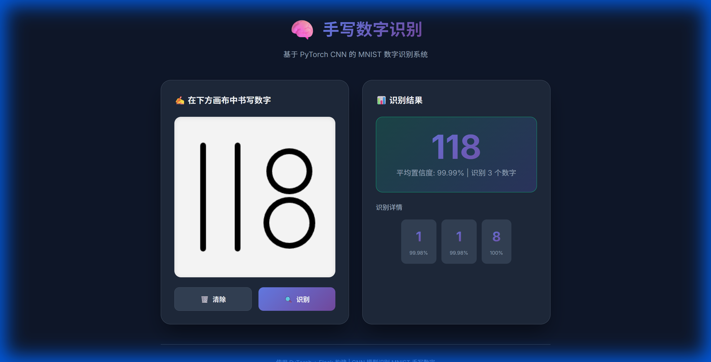

# 🧠 手写数字识别系统



基于 **PyTorch** 深度学习框架实现的本地手写数字识别系统。提供现代化的 Web 界面，使用自定义的 CNN 模型和图像分割算法，支持**多位数字**识别。

## ✨ 功能特点

- 🔢 **多位数字识别** - 支持同时识别多个数字（如 "2024"）
- 🧠 **本地 CNN 模型** - 使用在 MNIST 数据集上训练的卷积神经网络（准确率 >99%）
- 🚀 **高性能** - 完全本地运行，无需联网，无需繁重的 OCR 引擎
- ️ **实时交互** - Web 画布支持手写输入，即时返回识别详情
- 🎨 **现代 UI** - 深色主题，响应式设计，动态展示置信度

---

## 🚀 快速开始

### 环境要求

- Python 3.8+
- pip 包管理器

### 安装步骤

**1. 克隆项目**

```bash
git clone <repository-url>
cd AI
```

**2. 创建虚拟环境（推荐）**

```bash
# Windows
python -m venv venv
.\venv\Scripts\activate

# Linux/Mac
python -m venv venv
source venv/bin/activate
```

**3. 安装依赖**

```bash
pip install -r requirements.txt
```

**4. 训练模型（首次运行必须）**

项目默认未包含模型权重，请先运行训练脚本：

```bash
python src/train.py
```
*训练过程通常只需几分钟。*

**5. 启动 Web 应用**

```bash
python web/app.py
```

**6. 打开浏览器**

访问 [http://localhost:5000](http://localhost:5000)

---

## 📖 使用方法

1. 在左侧画布中随意手写数字（支持多位数字，请保持一定间距）
2. 点击「识别」按钮
3. 右侧显示完整的识别结果（如 "785"）和每个数字的置信度
4. 点击「清除」可重新书写

**使用技巧**：
- 书写多位数字时，数字之间尽量不要重叠
- 识别不准时尝试写大一点

---

## 📁 项目结构

```
F:\develop\AI\
├── data/                    # 数据集目录 (自动下载)
├── docs/                    # 文档资源
├── models/                  # 模型权重
│   └── mnist_cnn_best.pth   # CNN 模型权重 (训练后生成)
├── src/                     # 核心源代码
│   ├── model.py             # CNN 模型定义
│   ├── train.py             # 训练脚本
│   ├── predict.py           # 推理与图像分割逻辑
│   └── ocr_engine.py        # 识别引擎封装
├── web/                     # Web 应用
│   ├── app.py               # Flask 后端
│   └── ...
├── requirements.txt         # Python 依赖
└── README.md                # 项目说明
```
